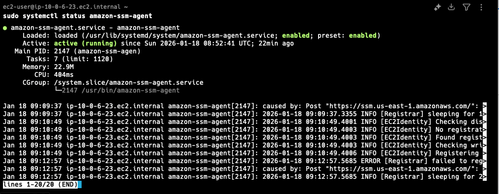

## Overview

AWS Systems Manager Session Manager is the recommended approach for connecting to bastion instances. It eliminates the need for SSH key pairs and provides better security, auditability, and access control.

### Why Use SSM Instead of Key Pairs?

Traditional SSH key pairs have several drawbacks:

- **Security Risk:** Key pairs are often shared across teams, increasing the attack surface.
- **Lack of Auditability:** Difficult to track who accessed the bastion and what commands were executed.
- **Rigid Access Control:** Revoking access requires deleting the entire key pair, affecting all users.
- **Management Overhead:** AWS doesn't store key pairs after creation - if lost, recovery is impossible.

## Benefits of SSM

- **Centralized Access Control:** Manage access via IAM policies - grant/revoke access without touching the instance.
- **Quick Response:** Immediately terminate all sessions in case of security incidents.
- **No Public IP Required:** Connect to instances in private subnets via VPC Endpoints.
- **Full Auditing:** Log every session and command to CloudWatch Logs or S3 for compliance.

## Considerations

- **Latency:** Session Manager tunnels traffic through AWS APIs, which may introduce slight lag compared to direct SSH connections.
- **Logging Costs:** While SSM is free, storing session logs in CloudWatch or S3 incurs costs. Consider configuring lifecycle rules or retention periods to manage costs.

For more information, refer to the [AWS Session Manager documentation](https://docs.aws.amazon.com/systems-manager/latest/userguide/session-manager.html).

## Prerequisites

Before connecting via SSM, ensure the following requirements are met:

### 1. IAM Role Configuration

The EC2 instance must have an IAM instance profile attached with the `AmazonSSMManagedInstanceCore` policy. This allows the SSM agent to communicate with AWS Systems Manager.

### 2. SSM Agent Installation

Ensure the SSM Agent is installed on your bastion host. Most Amazon Machine Images (AMIs) come with it pre-installed.

To verify the SSM Agent status, run:

```bash
sudo systemctl status amazon-ssm-agent
```
Example:



### 3. Security Group Configuration

With SSM, you can eliminate all inbound SSH traffic (port 22) in your Security Groups. Only outbound HTTPS (port 443) is required for communication with SSM.

> **Note**!\
> This is a significant security improvement as it reduces the attack surface by closing the SSH port entirely.

## Connecting to the Instance

### Via AWS Console

1. Navigate to the EC2 dashboard
2. Select your bastion instance
3. Click **Connect**
4. Choose the **Session Manager** tab
5. Click **Connect**

### Via AWS CLI

1. Install the [Session Manager plugin](https://docs.aws.amazon.com/systems-manager/latest/userguide/session-manager-working-with-install-plugin.html) for AWS CLI

2. Connect using the following command:

```bash
aws ssm start-session --target {instance-id}
```

## Port Forwarding to Private Resources

You can tunnel to private resources (like RDS databases) using SSM port forwarding:

```bash
aws ssm start-session \
  --target {instance-id} \
  --document-name AWS-StartPortForwardingSessionToRemoteHost \
  --parameters '{"host":["your-rds-endpoint"],"portNumber":["5432"],"localPortNumber":["5432"]}'
```
